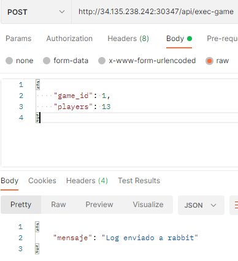

# MANUAL DE CONFIGRURACION
## INDICE
1. [Descripcion](#Descripcion)
2. [Configuración de maquina virtual](#Configuración-de-la-red-privada)
(#Pruebas-de-conexión-PING-y-configuración-del-protocolo-IP)
 
## Descripcion
***
Construir un sistema genérico de arquitectura distribuida que muestre estadísticas en tiempo real utilizando Kubernetes con el cual se logrará la visualización de los resultados de juegos implementados.

## Creación de cuenta en Google Cloud
1. Para la creación del servidor de la red privada, se crea una cuenta en  [Google Cloud](https://cloud.google.com/), la cual inicia con $300.00 de cortesía con una duración de tres meses. 
2. Se deberá habilitar el apartado Compute Engine API para la creación y ejecución de maquinas virtuales, se debe tener en cuenta que este servicio es de paga, por lo cual se debe contar con una tarjeta de débito o crédito.


3. Revisar que el apartado Compute Engine API, ya se encuentre habilitado. 

4. Se debe de crear una instancia de VM (Vitual Machine), que nos permitirá crear máquinas virtuales que se ejecutan en la infraestructura de Google Cloud. Configurar la instancia de la VM: 
    ```
    4.1. Especifica un Nombre para la VM.
    4.2. Opcional: Cambia la Zona para esta VM. Compute Engine aleatoriza la lista de zonas dentro de cada región para fomentar el uso en múltiples zonas.
    
    4.3. Selecciona una Configuración de máquina para la VM.
    
    4.4. En la sección Disco de arranque, haz clic en Cambiar para configurar tu disco de arranque. Luego, sigue estos pasos:
        4.4.1. Selecciona la pestaña Imágenes personalizadas.
        
        4.4.2. Selecciona el proyecto de imagen de la lista desplegable Mostrar imágenes de.
        
        4.4.3. Selecciona la imagen que deseas de la lista desplegable Imágenes.
    
        4.4.4. Haga clic en Seleccionar.
    
    4.5. Para permitir el tráfico HTTP o HTTPS a la VM, selecciona Permitir tráfico HTTP o Permitir tráfico HTTPS. Cloud Console agrega una etiqueta de red a tu VM y crea la regla de firewall de entrada correspondiente que permite todo el tráfico entrante en tcp:80 (HTTP) o tcp:443 (HTTPS). La etiqueta de red asocia la regla de firewall con la VM. Para obtener más información, consulta la Descripción general de las reglas de firewall en la documentación de la nube privada virtual.
    4.6. Haz clic en Crear para crear e iniciar la VM.
    ```


```Nota: El sistema operativo a utilizar en la VM es Ubuntu.```
## Requerimientos minimos
1. Contar con un navegador web
2. Contar con internet


## Creacion de clusters
```
gcloud container clusters create <nombre del cluster> --num-nodes=1 --tags=allin --enable-legacy-authorization --issue-client-certificate --preemptible --machine-type=n1-standar-2
``` 
## Cambiar de Clusters
```
gcloud container clusters get-credentials <Nombre cluster> --zone <Ubicacion ejemplo us-central1-a> --project <id del proyecto>
```
### Ver areas de trabajo
```
kubectl get namespaces
```
### Cambiar area de trabajo
```
kubectl config set-context --current --namespace=<nombre namespace>
```

## Ejecutar archivos kubernetes
### Creacion del archivo .yaml (Rabbit)
```
apiVersion: v1
kind: Namespace
metadata:
  creationTimestamp: null
  name: practica2-201503958
spec: {}
status: {}
---
apiVersion: apps/v1
kind: Deployment
metadata:
  creationTimestamp: null
  labels:
    app: my-rabbitmq

  name: my-rabbitmq
  namespace: practica2-201503958
spec:
  replicas: 2
  selector:
    matchLabels:
      app: my-rabbitmq
  strategy: {}
  template:
    metadata:
      creationTimestamp: null
      labels:
        app: my-rabbitmq
      
    spec:
      containers:
      - image: rabbitmq:3-management-alpine
        name: server-rabbit
        ports:
          - containerPort: 5672
          - containerPort: 15672     
        resources: {}   
status: {}
---
apiVersion: v1
kind: Service
metadata:
  creationTimestamp: null
  labels:
    app: my-rabbitmq
  name: my-rabbitmq
  namespace: practica2-201503958
spec:
  type: NodePort
  ports:
  - port: 5672
    protocol: TCP
    targetPort: 5672
  selector:
    app: my-rabbitmq
  
status:
  loadBalancer: {}


```

### Creacion del archivo .yaml (Servidor - cliente - suscriber)
```
apiVersion: apps/v1
kind: Deployment
metadata:
  creationTimestamp: null
  labels:
    app: servicios-practica
  name: servicios-practica
  namespace: practica2-201503958
spec:
  replicas: 1
  selector:
    matchLabels:
      app: servicios-practica
  strategy: {}
  template:
    metadata:
      creationTimestamp: null
      labels:
        app: servicios-practica
      
    spec:
      containers:
      - image: diemorales96/server_grpc_201503958
        name: server-grpc-rabbit
        ports:
          - containerPort: 50051
      - image: diemorales96/api_client_grpc_201503958
        name: client-grpc-rabbit
        ports:
          - containerPort: 2000
        resources: {}
        
status: {}
---
apiVersion: v1
kind: Service
metadata:
  creationTimestamp: null
  labels:
    app: servicios-practica
  name: servicios-practica
  namespace: practica2-201503958
spec:
  type: NodePort
  ports:
  - port: 2000
    protocol: TCP
    targetPort: 2000
  selector:
    app: servicios-practica
  
status:
  loadBalancer: {}
---
apiVersion: apps/v1
kind: Deployment
metadata:
  creationTimestamp: null
  labels:
    app: worker-rabbit
  name: worker-rabbit
  namespace: practica2-201503958
spec:
  selector:
    matchLabels:
      app: worker-rabbit
  strategy: {}
  template:
    metadata:
      creationTimestamp: null
      labels:
        app: worker-rabbit
    spec:
      containers:
      - image: diemorales96/suscriber_201503958
        name: worker-rabbit
status: {}

```
## Ejecutar archivos .yaml
```
kubectl apply -f <nombre>.yaml
```
## Eliminar archivos .yaml
```
kubectl delete -f <nombre>.yaml
```
### Mostrar todo lo que contiene el area de trabajo
```
kubectl get all
```
## Crear repositorios en Docker Hub
Docker Hub es un servicio de registro de repositorios proporcionado por estibador inc.

### Repositorios en Docker Hub
> pixisfeliz/api_client_grpc_201602790

> pixisfeliz/server_grpc_201602790

> pixisfeliz/suscriber_201602790

## Construccion de imagenes de docker localmente
```
docker buil -t <nombre del repositorio> .

```
## Subir imagenes al repositorio
```
docker push <nombre del repositorio>
```

## Comandos contenedores
### Parar contenedor 
> docker stop idcontenedor

### Eliminar contenedores
> docker system prune -a

### Descargar imagenes o construir contenedores
> docker -compose up -d

### Ver contenedores
> docker ps -a

### Apagar y eliminar contenedores
> docker-compose down

## Componentes

>	"context"

>	"encoding/json"

>	"fmt"

>	"io/ioutil"

>	"log"

>	"math"

>	"net/http"

>	"time"

>	"go.mongodb.org/mongo-driver/mongo"

>	"go.mongodb.org/mongo-driver/mongo/options"

## Requerimientos minimos
1. Contar con un navegador web
2. Contar con internet


## Interfaz
1. Registrar un juego


## Json
Estructura de archivo de envio:
```
{
	"gameid":2,
	"players":15
}
```